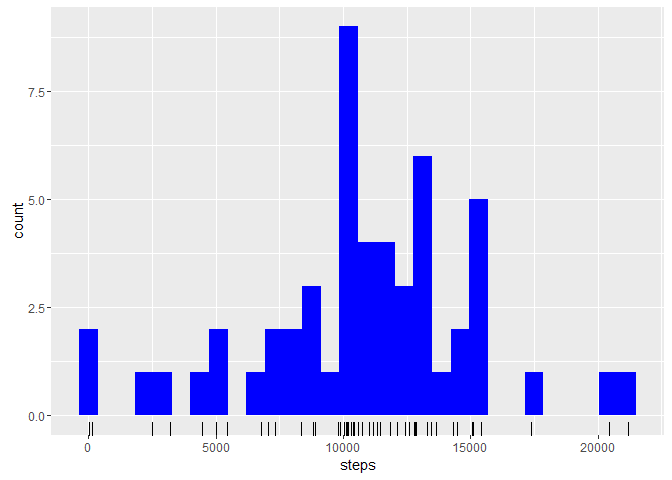
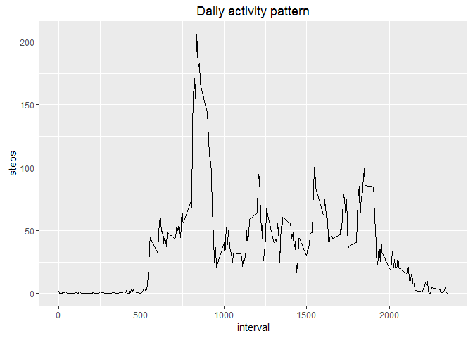
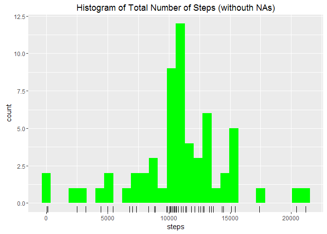
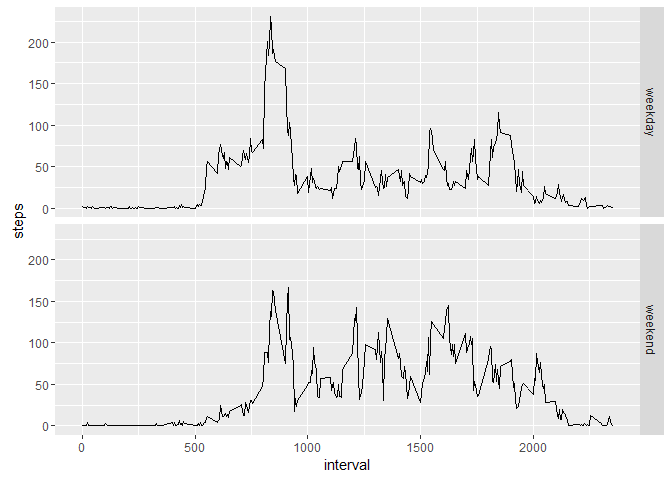

# Reproducible Research: Peer Assessment 1


## Loading and preprocessing the data
Before proceeding with answering the given question, we need first to load and process the data in order to have them in a suitable format for the analysis.

First thing to do, i will check if the data set have been previously downloaded, in order ot avoid extra work, if not, i will proceeed downloading it into the current working directory. Data will be then unzipped and will be read through the `read.csv` command.


Create a directory named "data" where to place the downloaded data

```r
data <- "data"
if(!file.exists(data)){
        dir.create(data)
        }
```

Assign the URL where to get the data to the object url_data 

```r
url_data <- "https://d396qusza40orc.cloudfront.net/repdata%2Fdata%2Factivity.zip"
```

Download the raw data

```r
archive <- paste(getwd(), "/activity.zip", sep = "")
if(!file.exists(archive)){
                download.file(url_data, archive, mode="wb")
        }
```

Unzip the raw data

```r
activity_file <- paste(getwd(), "/data/activity.csv", sep = "")
        if(!file.exists(activity_file)){
                unzip(archive, list = FALSE, overwrite = FALSE, exdir = data)
        }
```


Load the raw data into R

```r
activity <- read.csv(activity_file)
```

So let's take a look at the loaded data to see how they are structured, how many colums we have and what type of data we have

```r
str(activity)
```

```
## 'data.frame':	17568 obs. of  3 variables:
##  $ steps   : int  NA NA NA NA NA NA NA NA NA NA ...
##  $ date    : Factor w/ 61 levels "2012-10-01","2012-10-02",..: 1 1 1 1 1 1 1 1 1 1 ...
##  $ interval: int  0 5 10 15 20 25 30 35 40 45 ...
```

We see that we have integer for steps and interval while we have factor for date, which already tells us we need to convert this field into date format


```r
activity$date <- as.Date(as.character(activity$date))
```

Let's take a look at the beginning of this data set


```r
head(activity)
```

```
##   steps       date interval
## 1    NA 2012-10-01        0
## 2    NA 2012-10-01        5
## 3    NA 2012-10-01       10
## 4    NA 2012-10-01       15
## 5    NA 2012-10-01       20
## 6    NA 2012-10-01       25
```

```r
tail(activity)
```

```
##       steps       date interval
## 17563    NA 2012-11-30     2330
## 17564    NA 2012-11-30     2335
## 17565    NA 2012-11-30     2340
## 17566    NA 2012-11-30     2345
## 17567    NA 2012-11-30     2350
## 17568    NA 2012-11-30     2355
```

Looking at the tail of the dataset we see that each day contains 2355 intervals of 5 minutes each.

The data set looks now tidy and ready to explore.

Before proceeding with our analysis we want to first install the needed Packages, in this case i have chosen to utilize ggplot2 for charts, therefore we install it and load its library as follow:

```r
##install.packages("ggplot2")
library(ggplot2)
```

```
## Warning: package 'ggplot2' was built under R version 3.2.3
```


## What is mean total number of steps taken per day?

For this part of the assignment we can ignore the missing values in the dataset.

1. Calculate the total number of steps taken per day
2. Make a histogram of the total number of steps taken each day
3. Calculate and report the mean and median of the total number of steps taken per day

####Answer

1. First of all we calculate the total number of steps per day, as follow:


```r
total_step_day <- aggregate(steps ~ date, activity, sum)
```

The new objet `total_step_day` is a data set made of 2 columns:

```
##         date steps
## 1 2012-10-02   126
## 2 2012-10-03 11352
## 3 2012-10-04 12116
## 4 2012-10-05 13294
## 5 2012-10-06 15420
## 6 2012-10-07 11015
```

2. We display the obtained data with an Histogram (using the ggplo2 package previously uploaded). I will add a rug as well right below the x axis to show the data density


```r
Histogram1 <- ggplot(data=total_step_day, aes(steps)) + geom_histogram(fill="blue") + geom_rug()
print(Histogram1)
```

 

We want also to save our Histogram on a png file, which for convenience we have pre formatted it to 480x480 pixels. We print the output of the previously stored chart in object `Histogram1`


```r
png(file="Histogram1.png", height=480, width=480)
print(Histogram1)
dev.off()
```

```
## png 
##   2
```

3. We calculate the mean and meadian of the number of steps per day taking adavntage of the `summary` function, which will display few more details, however very good in this case to get Mean and Median


```r
summary(total_step_day$steps)
```

```
##    Min. 1st Qu.  Median    Mean 3rd Qu.    Max. 
##      41    8841   10760   10770   13290   21190
```

## What is the average daily activity pattern?
1. Make a time series plot (i.e. type = "l") of the 5-minute interval (x-axis) and the average number of steps taken, averaged across all days (y-axis)
2. Which 5-minute interval, on average across all the days in the dataset, contains the maximum number of steps?

####Answer

1. Before proceeding plotting the line chart to show the daily pattern we need to prepare the data for the chart


```r
mean_step_interval <- aggregate(steps ~ interval, activity, mean)
```
Which looks like this:


```r
head(mean_step_interval)
```

```
##   interval     steps
## 1        0 1.7169811
## 2        5 0.3396226
## 3       10 0.1320755
## 4       15 0.1509434
## 5       20 0.0754717
## 6       25 2.0943396
```

Now we can plot the time series using ggplot2 function

```r
TimeSeries1 <- ggplot(mean_step_interval, aes(interval, steps)) + geom_line() + ggtitle("Daily activity pattern")
print(TimeSeries1)
```

 


```r
png(file="TimeSeries1.png", height=480, width=480)
print(TimeSeries1)
dev.off()
```

```
## png 
##   2
```

2. To get the 5-minute interval with the max number of steps, on average, acrross all days, we start from the previously calculated data set and get a subset of it exactly for the row index (obtained with function which.max) which has the maximum number of steps


```r
interval_max <- mean_step_interval[which.max(mean_step_interval$steps),]
interval_max
```

```
##     interval    steps
## 104      835 206.1698
```

## Imputing missing values

Note that there are a number of days/intervals where there are missing values (coded as NA). The presence of missing days may introduce bias into some calculations or summaries of the data.

1. Calculate and report the total number of missing values in the dataset (i.e. the total number of rows with NAs)

2. Devise a strategy for filling in all of the missing values in the dataset. The strategy does not need to be sophisticated. For example, you could use the mean/median for that day, or the mean for that 5-minute interval, etc.

3. Create a new dataset that is equal to the original dataset but with the missing data filled in.

4. Make a histogram of the total number of steps taken each day and Calculate and report the mean and median total number of steps taken per day. Do these values differ from the estimates from the first part of the assignment? What is the impact of imputing missing data on the estimates of the total daily number of steps?

####Answer

1. Let's start to look at our original data set named activity and see how many NON complete cases we have. (please not that this function checks for non complete cases on all columns)


```r
sum(!complete.cases(activity))
```

```
## [1] 2304
```

This shows us that there are 0.1311475 % of non complete cases in our data set.
I got this number dividing previous one by all the cases with this command `sum(!complete.cases(activity))/nrow(activity)`)

2. We will now replace all missing values with the average number of steps taken for that 5-minute interval across all days


```r
activity_complete <- activity
incomplete_index<-which(!complete.cases(activity))
for (i in incomplete_index){
    activity_complete$steps[i] <- as.numeric(subset(mean_step_interval, interval %in% activity$interval[i], select = steps))
}
```

As requested by point 3 of the question, we store the new data set with filled in missing values in a new object, here is the head of it and it's structure


```r
head(activity_complete)
```

```
##       steps       date interval
## 1 1.7169811 2012-10-01        0
## 2 0.3396226 2012-10-01        5
## 3 0.1320755 2012-10-01       10
## 4 0.1509434 2012-10-01       15
## 5 0.0754717 2012-10-01       20
## 6 2.0943396 2012-10-01       25
```

```r
str(activity_complete)
```

```
## 'data.frame':	17568 obs. of  3 variables:
##  $ steps   : num  1.717 0.3396 0.1321 0.1509 0.0755 ...
##  $ date    : Date, format: "2012-10-01" "2012-10-01" ...
##  $ interval: int  0 5 10 15 20 25 30 35 40 45 ...
```

To be sure we made all right, let's check that there are no missing value in the new data set


```r
sum(!complete.cases(activity_complete))
```

```
## [1] 0
```

Excellent, this is what we were looking for, there are no missing values anymore.

4. Make a histogram of the total number of steps taken each day

first of all we need to prepare the data


```r
total_step_day_complete <- aggregate(steps ~ date, activity_complete, sum)
```


```r
Histogram2 <- ggplot(data=total_step_day_complete, aes(steps)) + geom_histogram(fill="green") + geom_rug() +
  ggtitle("Histogram of Total Number of Steps (withouth NAs)")
print(Histogram2)
```

 


```r
png(file="Histogram2.png", height=480, width=480)
print(Histogram2)
dev.off()
```

```
## png 
##   2
```


We will now calculate the mean and meadian of the steps taken per day and see if there is  adifference between the data without missing values compared to the original data with missing values


```r
total_step_day_complete <- aggregate(steps ~ date, activity_complete, sum)
```

Here is how it looks now Mean and Median for steps taken, based on data set without missing value


```r
summary(total_step_day_complete$steps)
```

```
##    Min. 1st Qu.  Median    Mean 3rd Qu.    Max. 
##      41    9819   10770   10770   12810   21190
```

Here instead it's the originally calculated Mean and Median, based on data set WITH missing values


```r
summary(total_step_day$steps)
```

```
##    Min. 1st Qu.  Median    Mean 3rd Qu.    Max. 
##      41    8841   10760   10770   13290   21190
```

We can conclude than that the Mean is ideantically the same in both cases, while the Median differes of 10 steps more and is now equal to the Mean

## Are there differences in activity patterns between weekdays and weekends?

For this part the ``weekdays()`` function may be of some help here. Use the dataset with the filled-in missing values for this part.

1. Create a new factor variable in the dataset with two levels - "weekday" and "weekend" indicating whether a given date is a weekday or weekend day.
2. Make a panel plot containing a time series plot (i.e. type = "l") of the 5-minute interval (x-axis) and the average number of steps taken, averaged across all weekday days or weekend days (y-axis). See the README file in the GitHub repository to see an example of what this plot should look like using simulated data.

####Answer

First thing to do is flag each date by weekday or weekend, to do this a possible way is to introduce a new information in the data set (wday) the day of the week obtrained by function weekday, and then proceeed with a for loop and create a factor varable which we call FalgDay by labelling each each row with "weekend" or "weekday" based on the day


```r
activity_complete$Wday <- weekdays(activity_complete$date)
str(activity_complete)
```

```
## 'data.frame':	17568 obs. of  4 variables:
##  $ steps   : num  1.717 0.3396 0.1321 0.1509 0.0755 ...
##  $ date    : Date, format: "2012-10-01" "2012-10-01" ...
##  $ interval: int  0 5 10 15 20 25 30 35 40 45 ...
##  $ Wday    : chr  "Monday" "Monday" "Monday" "Monday" ...
```

```r
for (i in 1:17568){
        if(activity_complete$Wday[i] %in% c("Saturday", "Sunday"))
                activity_complete$FlagDay[i] <- "weekend"
        else activity_complete$FlagDay[i] <- "weekday"
}

##convert the new column FlagDay into a factor variable
activity_complete$FlagDay <- as.factor(activity_complete$FlagDay)
```

Calculate the average number of steps taken, averaged across all weekday days or weekend days


```r
avgStepsInterval_complete <- aggregate(steps ~ FlagDay + interval, activity_complete, mean)
```

Prepare the output file TimeSeries2.png and define the area

```r
png(file="TimeSeries2.png", height=480, width=480)
```

Plot the time series

```r
TimeSeries2 <- ggplot(avgStepsInterval_complete, aes(interval, steps)) + geom_line() +
  facet_grid(FlagDay ~ .)
print(TimeSeries2)
```

 

```r
dev.off()
```

```
## png 
##   3
```
